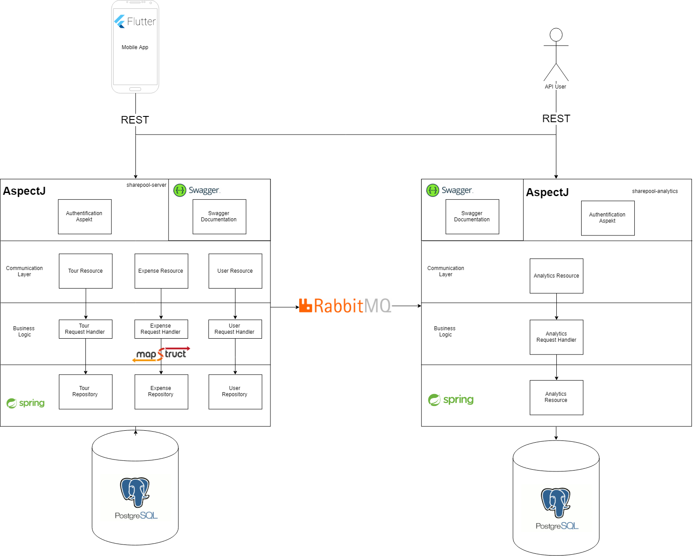

# SharePool Server
&copy; Tobias Kaderle & Jan Wiesbauer

## Beschreibung
Dieses Projekt stellt das Backend für die `SharePool-Mobileapp` dar. Bei SharePool handelt es sich um einen Anwendung, die das Bilden und Instandhalten einer Fahrgemeinschaft vereinfachen soll. Die komplette Vision für die Anwendung kann in diesem [Proposal](PROPOSAL.md) nachgelesen werden.

## Technologie- und Architekturstack
Das Server-Projekt umfasst 2 Mikroservices: `sharepool-server` und `sharepool-analytics`. API-Benutzer können mit diesen mittels `REST` kommunizieren. Intern wird `AMQP` bzw. dessen Referenzimplementierung `RabbitMQ` zum Informationsaustausch verwendet. Beide Mikroservices nutzen das `Spring-Framework` um ihrer Services zur Verfügung zu stellen. Intern werden die vielen Möglichkeiten von Spring, in Kombination mit anderen kompatiblen Frameworks, verwendet.

Folgendes Diagramm stellt den Architekturaufbau als auch die verwendeten Technologien des Servers im Detail dar.

Das Produkt kann/wird sowohl von der mobilen Anwendung, als auch von Endnutzer als API verwendet werden.

Spring stellt das Kern-Framework dar. Es bietet Möglichkeiten, die Ressourcen anzubieten und diese mit der Geschäftslogik zu verbinden. Die Geschäftslogik verwendet zudem das `MapStruct`-Framework, welches Code-Generierung für das Umwandeln zwischen DTOs der Kommunikationsschicht und Domain-Klassen anbietet. Dies erspart das schreiben von Boiler-Plate-Code.

Über `RabbitMQ` werden Informationen vom Server zum Analytics-Service übermittelt. Dieser bereitet diese auf und stellt für den Nutzer Statistik-Informationen zur Verfügung.

Als Datenbank wird `PostgreSQL` verwendet, da es in den Punkten Funktionalität und Skalierbarkeit überzeugen kann. Jeder einzelne Mikroservice erhält seine eigene Instanz, welches diese entkoppelt.

Die gesamte Infrastruktur, also beide PostgreSQL-Instanzen als auch der `RabbitMQ`-Server, werden mittels `Docker` zur Verfügung gestellt.

## Server Service
### REST-Interface
Die gesamte REST-Schicht wird mittels Swagger2 bzw. OpenApi dokumentiert. Diese Dokumentationen werden von den beiden Services individuell zur Verfügung gestellt. An dieser Stelle wird auf diese Dokumentation verwiesen:

* Lokal: [sharepool-server](localhost:8080/swagger-ui.html) und [sharepool-analytics](localhost:8081/swagger-ui.html)
* Remote: [sharepool-server](http://geanik.ddns.net:8080/swagger-ui.html) und [sharepool-analytics](http://geanik.ddns.net:8081/swagger-ui.html)

Die REST Schnittstelle entspricht zudem dem höchsten Reifegrad des `Rest Maturity Models`, da neben den herkömmlichen Anforderungen auch das Konzept von `HATEOAS` angewandt wird. Dies ermöglicht eine bessere Entkoppelung von Server und Client, da z.B. URLs von Ressourcen einfach geändert werden können ohne Integrationen zu brechen.

## Analytics Service
Ein weiterer Punkt, den wir in unsere App anbieten wollten, ist die Ansicht von Statistiken und Analyse-Daten. Im Grund soll der Benutzer sehen wieviele Fahrten ehr absolviert hat, und wieviel Treibstoff durch das gemeinsame Fahren eingespart wurde. Da diese Funktionalität gut von den Hautpfunktionalitäten (Tour-Verwaltung, Fahrten-Buchung, ...) entkoppelt werden kann, lagerten wir diese in einen weiteren Microservice aus.

Der Service ist auch mit Spring-Boot implementiert, und empfängt über RabbitMQ Informationen über neue gebuchte Fahrten. Wir haben uns für RabbitMQ entscheiden, da bei einer frequenten Nutzung des `Server-Services` es zu keiner Blockade kommt, wenn der `Analytics Service` nicht mit der Abarbeitung nachkommt. Die Nachrichten häufen sich einfach im Broker an und werden dann nach und nach abgearbeitet.

Über das Frontend kann ein User dann seine Analyse-Daten abfragen. Da diese pro Tag gleich aufsummiert angezeigt werden sollen, wird diese Transformation gleich am Server vollzogen. So wird an das Frontend eine `Map` mit Datum als Schlüssel gesendet, die als Werte die Summen der Fahrten und des gesparten Treibstoffs hat. So können die Daten direkt so in der UI angezeigt werde, ohne groß umgerechnet zu werden.